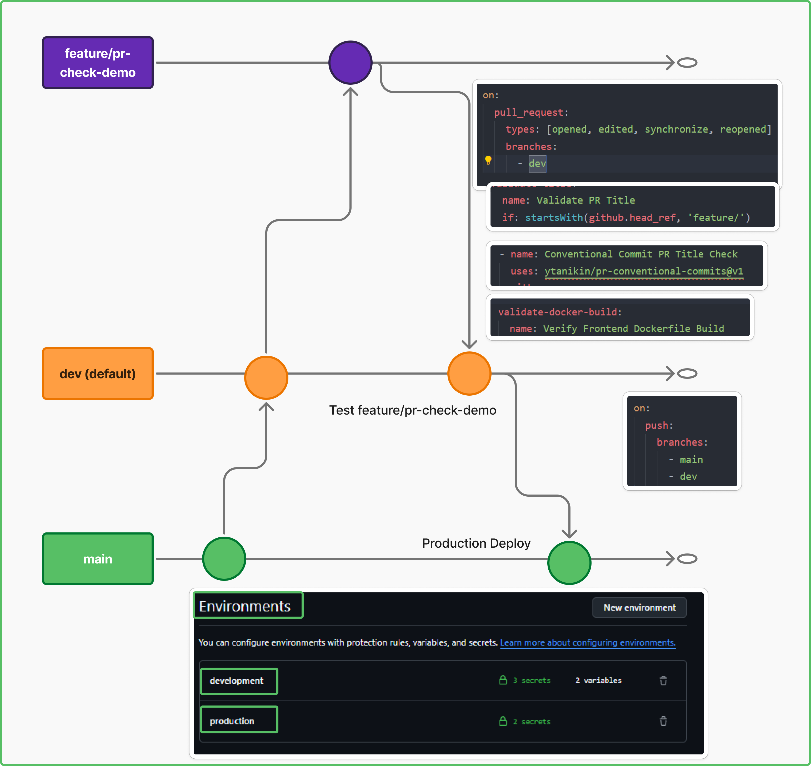

# FellowBlogs

### The branching strategy
   

---

### BUILDS: Branch Name and Commit hash for Development Environment
   

### BUILDS: Semantic Versioning for Production Environment

---

### Built and Pushed images in Dockerhub

### Enforced Conventional Commits and Docker Build Check

---